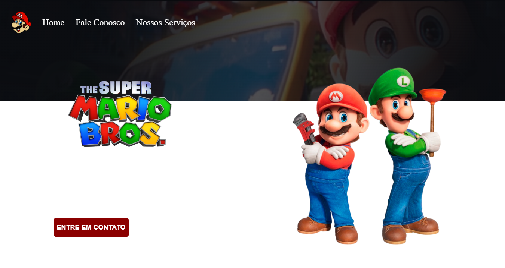

<h1 align="center">PROJETO PAGINA DO MARIO</h1>
 
 
<h2>Mais um projeto no realizado no <a href="www.devclub.com.br/devclub">DevClub</a></h2> 
 
 
<h3>Linguagens usadas nesse projeto:</h3>
 

<h3>E com uma pequena introdução ao:</h3> 
 

<h2>Esse projeto foi criado pra Desktop e Mobile </h2>
 

Desktop

